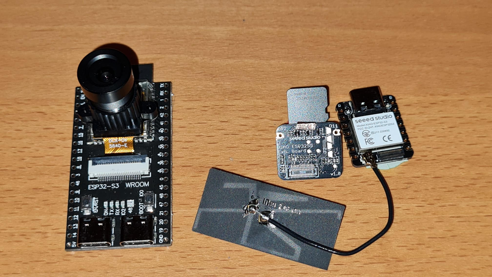
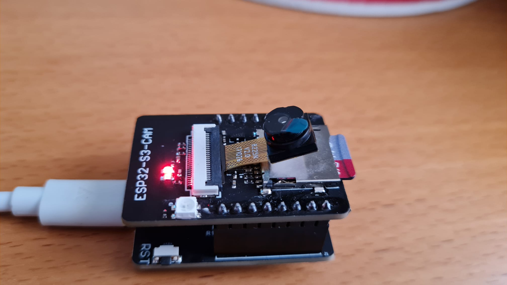

# ESP32CamTimeLapse

Timelapse TESTED on the following boards - others might also work:
  * ESP32-S3-WROOM1 CAM (resembels "Freenove ESP32-Wrover CAM") -> ESP32S3 Dev Module
  * ESP32-S3-CAM - new version -> ESP32S3 Dev Module - needs new serial adaptor to see anything on console; however flashing works with old ESP32-CAM adapter, just need to guess the camera IP without logs
  * XIAO ESP32S3 (Seed Studio) -> XIAO_ESP32S3 !! to activate SD might need to solder jumper, see https://wiki.seeedstudio.com/xiao_esp32s3_pin_multiplexing/ !!
  * ESP32-CAM -> AI Thinker ESP32-CAM - this also worked in the original bitlumi project
  * Others might work, however they were not tested. Some pin mappings for camera and SD card might need to be adjusted.

This code was forked from: https://bitluni.net/esp32camtimelapse

